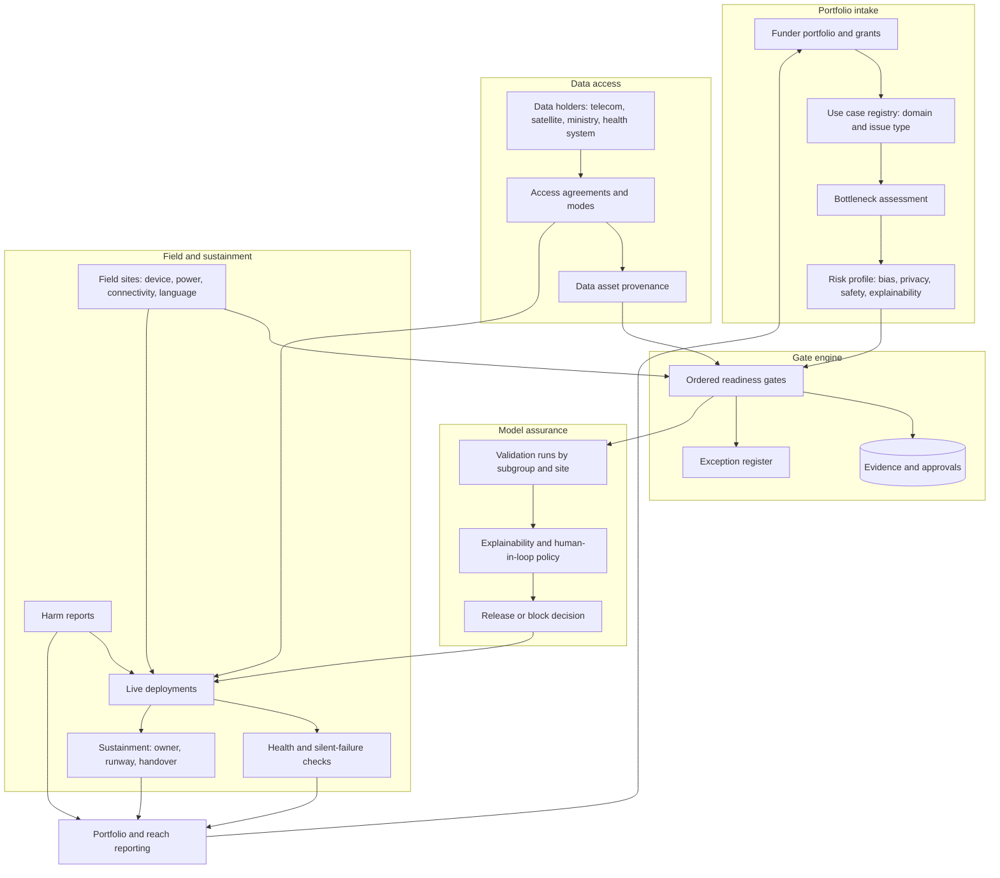

# Fieldproof

**Source:** `ai-in-for-good/MGI-Applying-ai-for-social-good-Discussion-paper-Dec-2018/`
**Domain:** `ai-forgood`
**One-liner:** A deployment assurance system for funders and implementing organisations putting AI into high-stakes humanitarian and development work: every use case must clear evidenced gates — problem definition, lawful data access, subgroup-tested validation, last-mile feasibility, and a named sustainment owner with funded runway — before a model is allowed to affect a real person, and every live deployment is watched for the day it quietly stops working.

**Wedge:** Philanthropic funders and their implementing partners in crisis response and health and hunger — the domains where the source finds mature capabilities and the highest potential usage frequency — running portfolios of ten to a hundred ai-enabled projects across multiple countries and grant cycles.

**Positioning:** Portfolio assurance for high-stakes AI, sitting between the funder and the field. It is not an MLOps platform: the source demonstrates that compute and libraries have stopped being the constraint, with a 93%-accuracy ImageNet model trainable for USD 25. It is not an impact dashboard either. The objects of value are the gate record that decides whether a model may touch a vulnerable population, and the custody record that names who keeps it running after the grant closes.

## Market research synthesis

### Thesis from source

The McKinsey Global Institute discussion paper assembles a library of about 160 AI social-impact use cases across ten domains — crisis response, economic empowerment, education, environment, equality and inclusion, health and hunger, information verification and validation, infrastructure management, public and social sector management, and security and justice — and maps them to all 17 UN Sustainable Development Goals, noting that roughly 21 of the 156 catalogued cases map to no SDG at all. Most domains hold around 15 use cases; health and hunger is the outlier with 28, information verification and validation the thinnest with four. The library's distribution of maturity is the paper's first uncomfortable finding: an actual AI deployment exists for only about one-third of the use cases, while three-quarters have seen some advanced-analytics deployment. The technology is not the frontier. The delivery is.

The paper's second contribution is a taxonomy of what stops delivery. It identifies 18 AI capabilities — 14 clustered in computer vision, natural language processing, and speech and audio processing, plus reinforcement learning, content generation and structured deep learning as stand-alones — and then 18 bottlenecks sorted into four bands of criticality. Three are named as the most significant. Data accessibility comes first: the data that matters is held by telecoms, satellite operators, social platforms, financial institutions, health providers and governments, and is withheld through regulation, privacy concern, bureaucratic inertia, or simply because it is monetisable and priced beyond an NGO's reach. Talent comes second, split in two: high-level expertise able to build complex multimodal models, and the data scientists and "translators" needed to run and interpret them; just over half the use cases can be built with lower-level AI experience, the rest cannot. Third is "last mile" implementation, which the paper treats as a first-class engineering constraint rather than an afterthought — smartphone penetration globally sits below 40% and below 50% across many developing regions, 90% of the 215 million visually impaired people who could benefit from environment-description software live in developing countries, and devices that need recharging fail where there is no electricity.

The paper's most product-shaped passage is its account of how these projects die. It describes an AI research tool built for a federal agency that nobody could install or run from the technical documentation, and that became unused "shelfware" once the contract with the research group expired: "failed handoffs will occur when solutions providers only set up the solution and then disappear without ensuring that a sustainable plan is in place." It compounds this with brittleness — models "failing when inputs stray in specific ways from the data sets on which the models were trained" — and with the risk that an implementing organisation without a data scientist or translator becomes "overly trusting of the model results." Box 3 turns the whole argument into a ten-step deployment checklist, insisting that steps one to three come first: define the societal problem with measurable objectives, translate it into a technical problem, and confirm that AI is genuinely the bottleneck rather than policy or incentives. Each step is annotated with the specific barriers to overcome and the specific risks to mitigate. That checklist is a workflow specification in everything but name.

The paper's fourth argument is that the risks here are not the commercial ones. It sorts them into bias and fairness, privacy, safe use and security, and explainability, and observes that the highest-magnitude risk sits in domains where data are sensitive and predictions identify individuals — economic empowerment, education, equality and inclusion, health, security and justice — while crisis response carries a distinct risk of inaccuracy, because "erroneous predictions of the location of missing persons could prove fatal," and a road wrongly reported clear of flooding can send thousands of people toward it. The bias evidence is specific: facial-analysis error rates of 0.8% for light-skinned men against 34.7% for dark-skinned women; a recruiting tool abandoned after showing systematic bias against women; a skin-cancer model that scored lesions as more likely cancerous when a ruler appeared in the image. On the mobile skin-cancer case the paper flags that liability for misdiagnosis — solution provider, healthcare provider or insurer — is unresolved, that some countries forbid health data leaving their borders, and that mitigation means human-in-the-loop validation, red-team testing, and consent designed like 23andMe's opt-in. It also shows the shape of workable data access: OPAL, a collaboration between the World Economic Forum, MIT Media Lab and Orange piloted in Colombia and Senegal, derives aggregated insight "without data leaving the company's server," and the International Charter on Space and Major Disasters commits satellite operators to open access during emergencies. Read as a whole, the paper describes a governance product: gated readiness, brokered data access under enforceable terms, subgroup-tested validation, last-mile feasibility, funded sustainment, and reach measured with the paper's own usage-frequency method.

### Buyer & economic model

- **Primary buyer:** the director of programmes or chief impact officer at a foundation or bilateral funder with an AI portfolio, who signs grants and carries the reputational risk when a funded model harms someone. The co-buyer is the chief digital or data officer of a large international NGO that both receives grants and runs deployments across country offices.
- **Users:** funder programme officers (gate review, disbursement conditions), implementing-organisation delivery leads (evidence submission, sustainment planning), data partner stewards inside telecoms, satellite operators, ministries and hospital systems (access terms, compute-to-data approvals), model risk and safeguarding reviewers (validation, bias, do-no-harm), field operations coordinators (last-mile constraints, device and connectivity reality), and evaluation staff producing funder-grade reach and outcome reporting.
- **Budget owner / value metric:** the grant and programme budget, plus the funder's monitoring, evaluation and learning line. The value metric is the share of funded AI deployments still running and still validated twelve months after handover — the anti-shelfware number — supported by cost per validated deployment and by the number of gate rejections that prevented spend on use cases where AI was not the bottleneck.
- **Competing status quo:** a grant proposal, a mid-term narrative report, a final report, and a slide deck of pilot accuracy figures. Readiness is assessed in a due-diligence call; data access is a memorandum of understanding in a shared drive; bias testing is whatever the implementing partner chose to run; sustainment is a paragraph of intent; and the funder discovers a model has stopped working when a country office mentions it in passing, if at all. Generic MLOps and experiment-tracking tools cover model plumbing but say nothing about whether a deployment is lawful, safe, staffed or survivable.

### Domain constraints

- **Regulatory / trust / safety:** data-localisation rules that forbid health and personal records leaving a country; humanitarian data-protection standards and the do-no-harm obligation toward populations who cannot meaningfully refuse; consent regimes for research and diagnostic use; unresolved liability for model-driven clinical or protection decisions, which the source names directly; the prospect of AI tools being misused by authorities against the very people they were built to help; and, in crisis settings, the fact that a wrong output is not a bad recommendation but a routed evacuation. Explainability is a hard requirement in individual-affecting cases rather than a nice property, and interventions that could be delivered by policy or incentives should be disqualified from AI funding at gate three.
- **Data sensitivity:** the underlying records — call detail, movement, biometric, health, protection case, welfare eligibility — identify vulnerable individuals, so the platform must treat data access as an agreement to be enforced, not a dataset to be copied. Compute-to-data and aggregate-only modes have to be first-class, as OPAL demonstrates. Training corpora need recorded provenance, labelling quality and known flaws so a later user can see what the data cannot support, and subgroup performance must be measured because a model that is accurate overall can be dangerous for a minority group.
- **Change-management realities:** implementing organisations are staffed for delivery, not for model stewardship, and cannot compete on salary with the commercial market for the talent the source says they need; grant cycles are shorter than the operational life of a model, so sustainment has to be funded and named before go-live rather than negotiated at closeout; volunteer and pro-bono technical capacity arrives in bursts and leaves; field teams work with feature phones, intermittent power and paper fallbacks, so a deployment that assumes a smartphone is a deployment that will not happen; and per-site retraining is a real cost, as the anti-poaching case shows, where each park's flora, fauna and weather change the data the model needs.

## Business requirements

- BR-1: No funded model may affect a real person before every applicable readiness gate is closed with named evidence and a named approver, and any gate closed by exception must carry a documented rationale, an owner and an expiry date.
- BR-2: Every use case must state the societal problem, the measurable objective, and the reason AI rather than policy, incentives or simpler analytics is the binding constraint; use cases that cannot pass that third test must be rejected before technical work is funded.
- BR-3: Data used in any deployment must be covered by a recorded access arrangement that states purpose, permitted access mode — open release, purchased, government release, emergency charter, or compute-to-data with no data leaving the holder — retention, and revocation terms, and expiry of that arrangement must suspend the deployment automatically.
- BR-4: Model validation must report performance by relevant subgroup and site, not in aggregate only, and a model whose worst-subgroup performance falls outside the approved tolerance must not be released regardless of its headline accuracy.
- BR-5: Every deployment must declare its human-in-the-loop policy and the explainability method available to the people affected, and in individual-affecting or life-safety use cases a deployment without both must be refused.
- BR-6: Last-mile feasibility must be evidenced against the actual field environment — device type, connectivity, power, language, literacy, and the staff who will operate the tool — before scale-up funding is released, with a fallback path stated for when the technology is unavailable.
- BR-7: Every deployment must have a named sustainment owner, a funded runway stated in months, and a completed capability handover before the implementation contract closes; deployments failing this test must be flagged to the funder as shelfware risk rather than reported as delivered.
- BR-8: Live deployments must be monitored for silent failure — stale inputs, drift beyond tolerance, collapsed usage, unreported outages — and a deployment that stops being used or stops being accurate must raise the same alarm as one that breaks loudly.
- BR-9: Suspected harm to an individual or community must be reportable by field staff without technical vocabulary, must trigger a time-boxed review with authority to suspend the deployment, and must never depend on the implementing partner self-reporting to its own funder.
- BR-10: Reported reach must be computed on a declared, auditable method — the source's usage-frequency approach, stating the population base and the run frequency per individual — and estimated reach must never be presented as verified outcome.
- BR-11: Talent dependencies must be explicit: each deployment must record where it needs high-level AI expertise, where a practitioner or translator suffices, and which of those roles is currently unfilled, so the funder can fund capability rather than discover the gap at handover.
- BR-12: The full assurance record for any deployment — gates, evidence, data terms, validation runs, incidents, handover — must be reconstructable for the funder's audit and evaluation window and readable by an external evaluator who was not present at any decision.

## User stories

Canonical user stories live in sibling [USER_STORIES.md](USER_STORIES.md).

## System design

### Overview

Fieldproof is a registry and gate engine wrapped around the life of a single AI use case, from problem statement to post-grant sustainment. A use case is registered against a domain and issue type, with its intended capability and data modality. It then passes through a gate sequence modelled on the source's ten-step checklist: problem defined with measurable objectives; translated into a technical problem; AI confirmed as the actual bottleneck; an organisation committed to deploy; data available; data accessible under recorded terms; data quality and provenance established; a model built and validated with subgroup breakdowns; value demonstrated in the target environment; and technical capability transferred so the model can be run without the builder. Each gate names its evidence, its blocking bottlenecks and the risks it must mitigate. Data access is held as enforceable agreements with modes that include compute-to-data and emergency charter release. Model releases carry validation runs, explainability methods and human-in-the-loop policies. Live deployments are monitored for both loud and silent failure, and harm reports from the field can suspend them. Sustainment is a first-class object with an owner, funded months and a handover state, and the funder sees the portfolio through gate status, risk profile, shelfware exposure and reach reported on a declared method.

### Actors & boundaries

- **Actors:** funder programme officer, implementing-organisation delivery lead, model risk and safeguarding reviewer, data partner steward, field operations coordinator, external evaluator, technical volunteer or vendor building the model, and the affected population — present in the system only as constraints, protections and aggregate counts.
- **Trust boundary:** the assurance record is shared between funder and implementing organisation; the underlying sensitive data is not. In compute-to-data and aggregate-only modes, nothing but derived results and audit metadata crosses the holder's boundary. Harm reports route to the reviewer and the funder directly, not through the implementing partner's own reporting chain. Evidence supporting a gate may be visible to an external evaluator while raw personal data never is.
- **Human-in-the-loop points:** gate approval and exception granting; data access approval and revocation by the steward; validation sign-off and release blocking by the reviewer; last-mile feasibility confirmation by field staff; harm-report adjudication and deployment suspension; sustainment handover acceptance by the named owner; sign-off of any externally published reach or impact figure.

### Core capabilities

1. **Use-case registry** — records the societal problem, domain and issue type, target population, capability and modality mix, and the funding attached.
2. **Gate engine** — the ordered readiness gates with required evidence, blocking bottlenecks, mitigating risks, approvals, exceptions and expiry.
3. **Bottleneck assessment** — scores the source's bottleneck set for this use case, distinguishing critical-for-most from contextual constraints, and tracks which are being actively resolved.
4. **Risk profiling** — scores bias, privacy, unsafe use and explainability requirements per use case and drives the depth of review.
5. **Data access brokerage** — agreements with holders, access mode, purpose limitation, retention, expiry, revocation, and automatic suspension of dependents.
6. **Data asset provenance** — source, labelling effort and quality, known flaws, representativeness notes, and what the asset must not be used to claim.
7. **Model assurance** — validation runs with subgroup and site breakdowns, explainability method, human-in-the-loop policy, red-team results, release and block decisions.
8. **Field feasibility** — site-level device, connectivity, power, language and staffing constraints, with fallback paths and per-site retraining needs.
9. **Deployment health monitoring** — drift, input staleness, usage collapse, outage and incident signals for live deployments.
10. **Harm reporting and adjudication** — plain-language intake, time-boxed review, suspension authority, and recorded outcome.
11. **Sustainment custody** — named owner, funded runway, capability handover checklist, and post-grant survival tracking.
12. **Portfolio and impact reporting** — gate and risk rollups, shelfware exposure, talent gaps, and reach estimates computed on a declared usage-frequency method.

### Conceptual data

- **Primary entities:** Portfolio, Grant, UseCase, ReadinessGate, GateEvidence, BottleneckAssessment, RiskProfile, DataHolder, DataAccessAgreement, DataAsset, ModelRelease, ValidationRun, ExplainabilityMethod, HumanInLoopPolicy, FieldSite, LastMileConstraint, Deployment, DeploymentHealthCheck, HarmReport, TalentAssignment, SustainmentPlan, CapabilityHandover, ReachEstimate, ImpactReport.
- **Critical events:** use case registered; gate submitted, approved, rejected or excepted; bottleneck raised or cleared; data agreement granted, amended, expired or revoked; dependent deployment suspended; validation run completed; release approved or blocked; deployment activated, degraded, suspended or retired; harm reported and adjudicated; talent role filled or vacated; handover accepted; runway exhausted; reach estimate published.
- **Retention / audit needs:** the assurance record — gates, evidence references, approvals, exceptions, data terms, validation results, incidents, handovers — is retained for the funder's evaluation and audit window and must remain legible to an evaluator with no institutional memory. Harm reports are retained with reporter identity protected and separable. Personal data from the underlying corpora is never retained in the registry; what is retained is provenance, permitted purpose and access mode. Published reach figures are retained with their computation method, population base and run frequency so a number can be re-derived years later.

### Integrations (conceptual)

- **Systems of record:** the funder's grant management system, the implementing organisation's programme and project management systems, humanitarian information management and case management systems, and the evaluation and reporting stack that consumes results.
- **Upstream signals:** data holders' access and revocation systems (telecom, satellite, ministry, hospital), emergency data mechanisms such as the space-and-major-disasters charter for the duration of an event, model training and serving environments reporting validation and drift metrics, device and connectivity inventories from country offices, and volunteer or vendor capacity rosters.
- **Downstream actions:** disbursement conditions and holds in the grant system, suspension instructions to serving environments when an agreement lapses or a harm report is upheld, handover checklists and capability funding requests, escalations to safeguarding leads, retraining requests per site, and funder-facing portfolio and impact reports.

### High-level architecture

Gating is a slow, evidentiary path; deployment health is a continuous path; harm reporting is an out-of-band path that must never be filtered by the party being assessed. Keeping them separate is what allows assurance to be strict without making day-to-day field operation dependent on the funder's review calendar.

### Success metrics

- **Leading:** share of use cases rejected or redirected at the "is AI the bottleneck" gate; share of deployments with a lawful, unexpired data agreement at all times; share of releases with subgroup-level validation and a declared explainability method; share of sites with evidenced last-mile constraints before scale-up; median days from harm report to adjudication; share of deployments with a named sustainment owner and funded runway before contract close; number of unfilled talent roles per live deployment.
- **Lagging:** share of funded deployments still running and still validated twelve months after handover — the direct counter to the source's shelfware account; cost per surviving validated deployment; number of upheld harm reports and time to remediation; measured worst-subgroup performance gap across the portfolio, benchmarked against the source's 0.8% versus 34.7% facial-analysis disparity; reach delivered against reach estimated on the declared usage-frequency method; proportion of the portfolio dependent on a single data holder or a single individual's expertise.

## OpenAPI skeleton

Canonical HTTP surface lives in sibling [openapi.yaml](openapi.yaml). Summary:

- **Base path:** `/v1/...`
- **Auth:** `X-API-Key` for machine-to-machine reporting from serving environments, data-holder systems and grant platforms; Bearer JWT for funder, reviewer, delivery-lead and field-coordinator consoles.
- **Resource groups:** UseCases, Gates, DataAccess, ModelAssurance, FieldSites, Deployments, Sustainment, Incidents, Reporting.
