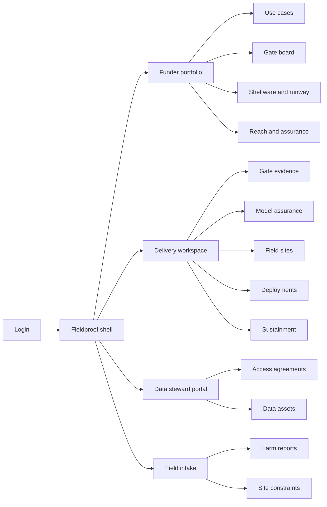
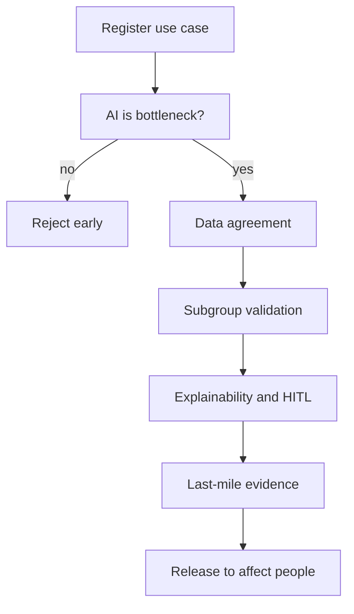
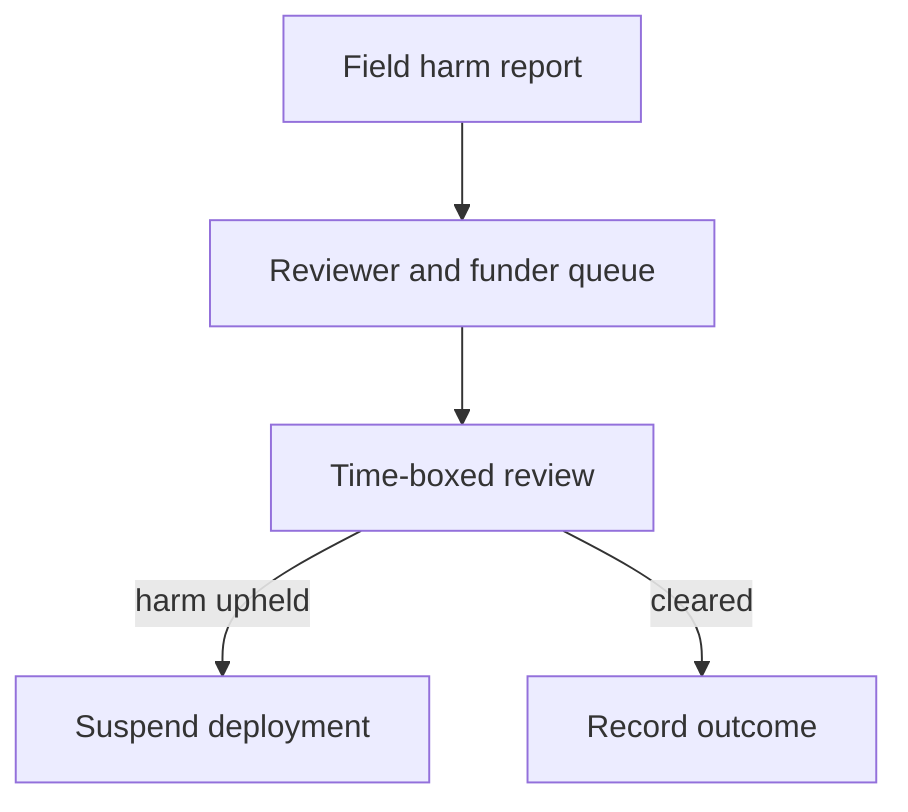

# Fieldproof — Web app

**Product:** [PRODUCT.md](./PRODUCT.md)
**Primary surface:** Portfolio assurance console (funder + implementing-partner gate and custody workspace)
**Secondary surfaces:** Field harm-report intake (plain-language, low-bandwidth); data-holder steward portal (agreements and revocation); read-only evaluator assurance pack export
**Design thesis:** Fieldproof is a deployment assurance ledger for high-stakes AI — not an impact dashboard and not an MLOps cockpit. The metaphor is a flight clearance board: ordered gates with named evidence and named approvers, then a custody strip that answers who keeps the model flying after the grant ends. Visual language is deep navy and signal-amber on a cool paper-grey ground: closed gates feel stamped; exceptions feel provisional with an expiry; silent-failure and harm states interrupt like a tower hold. The Fieldproof wordmark sits as a quiet seal on every gate and custody screen so funders and evaluators know whose assurance record they are reading years later.

## UX research synthesis

### Category peers (best-in-class)

- **Credo AI / Holistic AI (AI governance registries):** Policy packs, evidence binding, and release gates before models touch production. Steal: gate as a first-class object with required artefacts and approver identity; reject enterprise “responsible AI score” rainbows that hide whether a worst subgroup failed.
- **Fluxx / Grantbook-style grant ops:** Disbursement conditions and portfolio risk views for programme officers. Steal: hold disbursement until conditions clear; shelfware-style runway alerts; reject proposal-narrative as the only readiness signal.
- **OCHA HDX / humanitarian data exchange patterns:** Purpose-limited sharing and steward controls without dumping raw population data into every tool. Steal: access mode as a visible contract (open, purchased, government, emergency charter, compute-to-data); reject “upload the CSV” as the default data path.
- **ActivityInfo / DevResults (field M&E):** Site-level constraint capture and low-friction field reporting under intermittent connectivity. Steal: plain-language incident intake and site constraint forms; reject desktop-only dense BI as the field coordinator’s primary UI.

### Patterns to adopt / reject

- **Adopt:** Ordered gate sequence with early “is AI the bottleneck” kill; subgroup/site validation as release-blocking; data-agreement expiry auto-suspends dependents; sustainment owner + funded runway before contract close; harm reports that bypass implementer self-reporting; reach labelled by computation method never as verified outcome.
- **Reject:** Accuracy-only pilot scoreboards as go-live proof; purple “AI for good” glow marketing chrome; editable impact totals; MLOps experiment grids as the funder home; chatbot as the gate reviewer; dashboard-of-SDGs that buries custody and harm.

### Trust, density, and workflow constraints from PRODUCT.md

No model may affect a person before every applicable gate is closed with evidence and an approver — exceptions need rationale, owner, and expiry (BR-1, BR-2). Data access is an enforceable agreement with modes including compute-to-data; expiry suspends deployment (BR-3). Subgroup failure outside tolerance blocks release regardless of headline accuracy (BR-4). Individual-affecting cases require explainability and human-in-the-loop or refusal (BR-5). Last-mile reality and sustainment custody are funding conditions, not footnotes (BR-6, BR-7). Silent failure and field harm must alarm as loudly as a crash (BR-8, BR-9). Reach is auditable method, not marketing (BR-10). Talent gaps are explicit funding objects (BR-11). The full record must be reconstructable for an external evaluator (BR-12).

## Information architecture

### Nav model

### Roles → default home

| Role | Default home | Why |
|------|--------------|-----|
| Funder programme officer | Funder portfolio — gate status and shelfware | Disbursement on readiness, not narrative (BR-1, BR-7) |
| Implementing delivery lead | Delivery workspace — open gates | Evidence requirements stated up front |
| Model risk / safeguarding reviewer | Model assurance queue | Subgroup and HITL release blocks (BR-4, BR-5) |
| Data partner steward | Steward portal | Defendable access modes and revocation (BR-3) |
| Field operations coordinator | Field intake | Constraints and plain-language harm (BR-6, BR-9) |
| Evaluation / external auditor | Assurance pack export | Reconstructable record (BR-12) |

### Cross-links to OpenAPI resources

| Nav area | OpenAPI tags / resources |
|----------|---------------------------|
| Use cases, bottlenecks, risk | UseCases |
| Gate board, evidence, exceptions | Gates |
| Agreements, assets, revocation | DataAccess |
| Validation, release/block | ModelAssurance |
| Site constraints | FieldSites |
| Live health, suspension | Deployments |
| Owner, runway, talent, handover | Sustainment |
| Harm reports | Incidents |
| Portfolio assurance, reach | Reporting |

## Screen inventory

### Funder portfolio home

- **Purpose:** Answer “which funded AI may touch people, which is shelfware risk, and where is disbursement rightly held?” in one composition.
- **Entry:** Programme officer login default.
- **Layout regions:** Brand + portfolio switcher; strip (gates cleared vs held, live vs suspended, shelfware within two quarters, open harm reviews); use-case table by domain and gate status; alerts rail (agreement expiry, silent failure, talent gaps).
- **Primary actions:** Open gate board; hold/release disbursement condition; open shelfware list.
- **Empty / loading / error:** Empty = register first use case from grant; loading = skeleton strip; error = retry with request id.
- **BR / story ties:** BR-1, BR-7, BR-8; funder stories.

### Use-case registry

- **Purpose:** Capture societal problem, measurable objective, domain/issue type, capability mix, and why AI — not policy or incentives — is the binding constraint.
- **Entry:** Portfolio → Use cases; create from grant link.
- **Layout regions:** Problem statement; measurable objectives; ai-bottleneck rationale; bottleneck assessment; risk profile (bias, privacy, unsafe use, explainability).
- **Primary actions:** Submit for gating; reject early if AI is not the bottleneck; open risk-driven review depth.
- **Empty / loading / error:** Missing bottleneck rationale = cannot advance past gate three.
- **BR / story ties:** BR-2, BR-11; programme officer early-reject story.

### Gate board

- **Purpose:** Ordered readiness gates with required evidence, named approver, exception register, and expiry — the clearance board.
- **Entry:** Use case → Gates; funder and delivery shared view with role-gated actions.
- **Layout regions:** Vertical gate sequence (problem → technical → AI bottleneck → org → data available → data accessible → provenance → validation → field value → handover); evidence pane per gate; decision/exception drawer; bottleneck blockers.
- **Primary actions:** Submit evidence; approve/reject; grant exception with owner and expiry; escalate.
- **Empty / loading / error:** Exception overdue = coral hold; incomplete evidence = submit disabled.
- **BR / story ties:** BR-1, BR-2, BR-12.

### Data access brokerage

- **Purpose:** Record agreements with holders — purpose, mode (open, purchased, government, emergency charter, compute-to-data), retention, revocation — and auto-suspend dependents on expiry.
- **Entry:** Steward portal or delivery → Data access.
- **Layout regions:** Agreement list; mode badge; purpose limitation; dependent deployments; revoke control; provenance links (no raw personal rows).
- **Primary actions:** Approve/amend agreement; revoke; view which deployments rely on this data.
- **Empty / loading / error:** Expired agreement = dependent deployments suspended banner; compute-to-data = “no export” seal.
- **BR / story ties:** BR-3; steward stories.

### Model assurance and release

- **Purpose:** Validation by subgroup and site; explainability method; human-in-the-loop policy; release or hard block.
- **Entry:** Reviewer queue; delivery → Model assurance.
- **Layout regions:** Validation run table with worst-subgroup vs tolerance; site breakdown; explainability and HITL declarations; red-team notes; release/block decision with rationale.
- **Primary actions:** Sign off validation; block release; require HITL before individual-affecting go-live.
- **Empty / loading / error:** Aggregate-only accuracy = insufficient for release; missing explainability on individual-affecting = refuse.
- **BR / story ties:** BR-4, BR-5; reviewer stories.

### Field sites and last-mile

- **Purpose:** Evidence device, connectivity, power, language, literacy, and staffing reality before scale-up funding; state fallbacks.
- **Entry:** Field coordinator; delivery → Field sites.
- **Layout regions:** Site list by country; constraint form; fallback path; per-site retraining need; scale-up readiness flag.
- **Primary actions:** Record constraints; confirm feasibility; block scale-up when smartphone/bandwidth assumed falsely.
- **Empty / loading / error:** No sites = scale-up funding held; low-bandwidth form with large controls.
- **BR / story ties:** BR-6; field coordinator stories.
- **Mobile notes:** Primary field surface; works on mid-range Android; offline draft queue desirable later — v1 web assumes intermittent sync with clear “last synced” state.

### Deployment health

- **Purpose:** Watch live deployments for loud and silent failure — drift, stale inputs, usage collapse, outages — with equal alarm weight.
- **Entry:** Deployments nav; funder alerts.
- **Layout regions:** Health strip; silent-failure signals; agreement-linked suspension state; open incidents; usage vs expected frequency.
- **Primary actions:** Suspend; acknowledge alert; open harm adjudication; request retraining.
- **Empty / loading / error:** Healthy = calm state message (not blank); collapsed usage = same severity chrome as outage.
- **BR / story ties:** BR-8.

### Harm report intake and adjudication

- **Purpose:** Plain-language suspected harm from field staff; time-boxed review with suspension authority; path that does not depend on implementer self-reporting to its funder.
- **Entry:** Field home; reviewer/funder incident queue.
- **Layout regions:** Simple intake (what happened, who affected, when, site); status and deadline; adjudication pane; suspension control; reporter-identity protection.
- **Primary actions:** Submit report; adjudicate; suspend deployment; record outcome.
- **Empty / loading / error:** Empty queue = “no open harm reviews”; overdue = coral deadline pulse.
- **BR / story ties:** BR-9.

### Sustainment custody

- **Purpose:** Named owner, funded runway in months, talent roles filled/unfilled, and capability handover before implementation contract closes.
- **Entry:** Delivery → Sustainment; funder shelfware view.
- **Layout regions:** Owner and runway meter; talent assignment matrix; handover checklist; shelfware risk flag to funder.
- **Primary actions:** Accept handover; request continuity funding; flag shelfware risk.
- **Empty / loading / error:** No owner or runway &lt; two quarters = amber/coral shelfware banner; cannot mark “delivered” without handover.
- **BR / story ties:** BR-7, BR-11.

### Portfolio reach and assurance reporting

- **Purpose:** Roll up gates, risk, shelfware, and reach on a declared usage-frequency method with population base — never present estimate as verified outcome.
- **Entry:** Funder Reporting; evaluator export.
- **Layout regions:** Assurance rollup; reach estimate with method, population base, run frequency labels; export pack; comparison of estimated vs measured where available.
- **Primary actions:** Publish labelled reach; export evaluator pack; drill to use case.
- **Empty / loading / error:** Missing method = cannot publish; watermark “estimate” on non-verified figures.
- **BR / story ties:** BR-10, BR-12.

### Assurance pack (evaluator)

- **Purpose:** Reconstruct gates, evidence references, data terms, validation, incidents, and handover for someone who was not in the room.
- **Entry:** Read-only evaluator link or Reporting → Export.
- **Layout regions:** Chronological assurance timeline; artefact index; redacted harm summaries; machine-readable export.
- **Primary actions:** Export; deep-link to gate decision.
- **Empty / loading / error:** Outside retention = explicit expiry.
- **BR / story ties:** BR-12.

## Key flows

1. **Register to first-person affect** — register use case → pass ai-bottleneck gate → data agreement → subgroup validation + HITL/explainability → last-mile evidence → release; failure: any open gate or blocked release prevents affecting people.

2. **Agreement expiry suspends deployment** — agreement nears expiry → alert → expire/revoke → dependent deployments auto-suspend → steward renew or retire (BR-3).

3. **Harm report to suspension** — field plain-language report → funder/reviewer queue (not implementer-only) → time-boxed adjudication → suspend or clear with record (BR-9).

4. **Shelfware prevention** — before contract close require owner + runway + handover → else flag shelfware risk to funder; post-grant survival tracked at twelve months (BR-7).

5. **Publish reach** — declare usage-frequency method and population base → label estimate → publish; block if method missing (BR-10).

## Design system

### Tokens (CSS variables)

- `--color-ink: #1A2332` — primary text on light ground
- `--color-paper: #E8EDF2` — app ground (cool paper, not cream)
- `--color-paper-elevated: #F4F7FA` — panels
- `--color-navy-950: #0B1C2C` — chrome / dark strips
- `--color-navy-800: #16324A` — nav
- `--color-signal: #C45C14` — amber signal for exceptions, runway watch, silent failure
- `--color-signal-dim: #8A3F0E`
- `--color-cleared: #2F6F5E` — gate cleared / agreement active (deep teal, not neon green)
- `--color-hold: #B33A3A` — gate reject, suspend, harm overdue
- `--color-steel: #5C6B7A` — secondary labels
- `--color-brand: #1E3A5F` — Fieldproof wordmark on paper; `--color-brand-on-dark: #D6E4F0` on navy
- `--font-display: "Source Serif 4", serif` — gate titles and portfolio headlines (institutional, not startup)
- `--font-body: "IBM Plex Sans", sans-serif` — forms and tables
- `--font-mono: "IBM Plex Mono", monospace` — agreement ids, gate keys, model release ids
- `--space-1`…`--space-8`: 4px scale
- `--radius-sm: 4px`; `--radius-md: 6px` — stamped-document feel, not pill UI
- `--motion-stamp: 180ms ease-out` — gate cleared stamp
- `--motion-hold: 280ms ease-in-out` — hold/suspend pulse
- `--motion-silent: 400ms ease-in-out` — silent-failure attention (slower than outage flash)
- Atmosphere: soft navy vignette on portfolio home; gate board reads like a clearance strip with hairline rules; field intake is higher contrast, larger type, minimal chrome. No stock “hopeful children” hero photography in the console.

### Typography & brand

- Serif display for gate names and portfolio titles; sans for operational density; mono for ids and method footnotes on reach.
- Brand seal left of shell on every gate, custody, and report view; never replaced by “Impact” as the strongest mark.
- Login shell: brand as hero-level signal; one headline (“No model touches people without clearance”); one CTA — no SDG icon rows.

### Do / don’t

- **Do:** Show gate order and open blockers; label reach method on every figure; equal chrome for silent and loud failure; protect harm-reporter identity; stamp exceptions with expiry.
- **Don’t:** Purple ai-for-good gradients; accuracy-only go-live badges; editable outcome totals; MLOps charts as funder home; card grids of SDG icons; emoji status; rounded-full pills for every filter.

### Accessibility & domain trust cues

- Contrast AA+ for signal/cleared/hold on paper and navy; never colour-alone — gates show “Cleared” / “Held” / “Excepted” text.
- Live regions announce suspension, agreement expiry, and harm-deadline changes.
- Field intake: large targets, plain language, minimal jargon; focus order prioritises report submit.
- Evaluator export is machine-readable; personal corpora never appear in the registry UI.

## Component patterns

- **GateStrip** — ordered gates with state, evidence count, approver, exception expiry.
- **BottleneckKillSwitch** — early reject when AI is not the binding constraint.
- **AccessModeBadge** — open / purchased / government / emergency charter / compute-to-data.
- **SubgroupToleranceTable** — worst subgroup vs approved tolerance; blocks release when outside.
- **HitlExplainPanel** — required pair for individual-affecting releases.
- **SilentFailureAlert** — usage collapse / drift / stale inputs with same weight as outage.
- **HarmIntakeForm** — plain-language field report with deadline chip.
- **RunwayMeter** — funded months vs two-quarter shelfware threshold.
- **TalentGapMatrix** — high-level vs translator roles filled/unfilled.
- **ReachMethodFootnote** — population base + run frequency; estimate watermark.
- **AssuranceTimeline** — reconstructable event chain for evaluators.
- **DependentSuspendBanner** — agreement expiry cascading to deployments.

## Out of scope for v1 web

- Model training / experiment tracking (MLOps); grant accounting ERP replacement; case-management for protection programmes; public beneficiary-facing apps; satellite or telecom data platforms themselves (broker agreements only); offline-native mobile apps beyond responsive field web; white-label portals for every sub-grantee tier.
